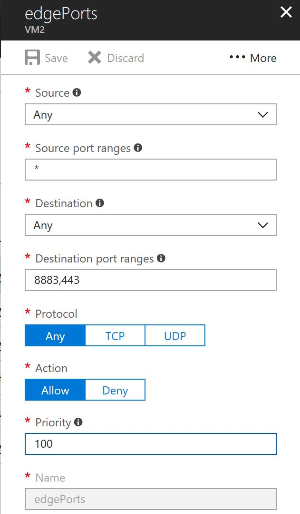
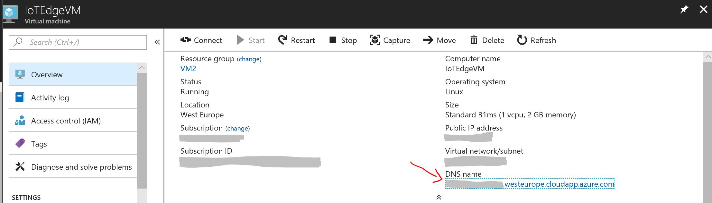
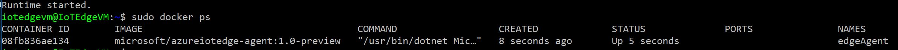
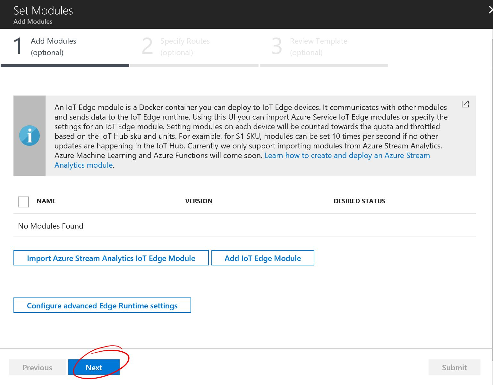
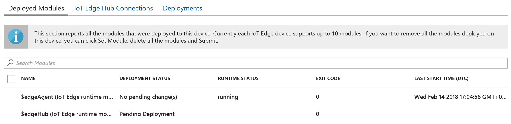
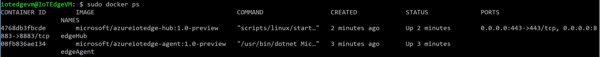
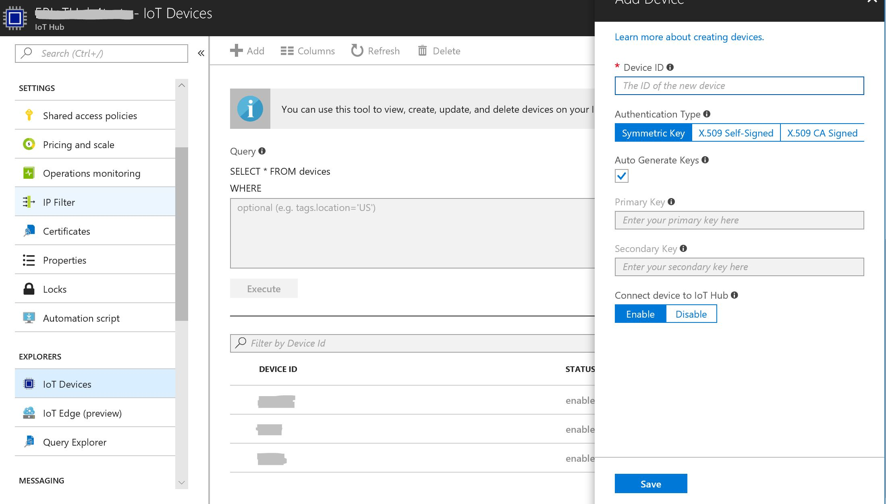
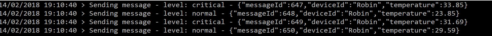
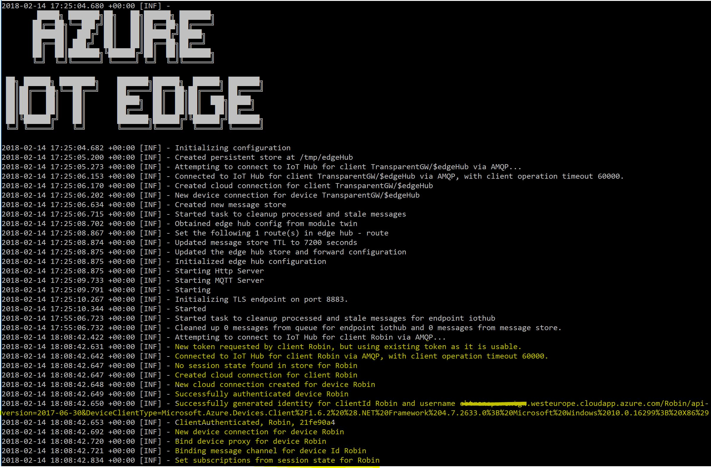
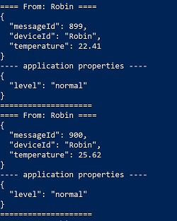

# Azure IoT Edge as Transparent Gateway #

Thanks to [Azure IoT Edge](https://docs.microsoft.com/en-us/azure/iot-edge/) it's possible to move analytics and custom business logics on the edge, closer to the devices, and send to the cloud only the filtered, manipulated, anonymized data. 

It's possible to connect leaf devices to Azure IoT Edge and connect it to Azure IoT Hub, for instance if the devices are not able to use MQTT, AMQP, HTTP so can't connect to IoT Hub direclty. 
But it's also possibile to use Azure IoT Edge as a Transparent Gateway: each leaf device has its own identity on IoT Hub, and also the Edge device has its own one, but messages pass thru IoT Edge. 
To go deeper on different gateway scenarios, please visit the [official documentation](https://docs.microsoft.com/en-us/azure/iot-edge/iot-edge-as-gateway). 

Here you can find some guidelines to deploy Azure IoT Edge on an Azure VM acting as transparent gateway and create a simple console application sending data to IoT Hub thru this gateway. 

## Create and configure an Azure VM to be used as IoT Edge device##

First of all, we need to [create a VM on Azure](https://docs.microsoft.com/en-us/azure/virtual-machines/linux/quick-create-portal). For the purpose of this sample, I created a simple Linux B1ms and choose *Password* instead of *SSH* as authentication type. following the linked tutorial, you will also see how to connect to the VM and how to create a new inbound security rule.  
We actually need to add an inbound security rule in the Network Security Group to allow traffic on ports 8883 and 443, used by Azure IoT Edge. 

 
Then, to connect to the VM I used the [Windows Subsystem for Linux](https://docs.microsoft.com/en-us/windows/wsl/about). It will be asked you if you are sure to continue with the authentication and then you need to insert the password you choose when you created your VM. 

We can also change the DNS name, just slicking on it. We'll use it later to setup Azure IoT Edge.

## Deploy Azure IoT Edge on the Linux VM with empty configuration ##

This VM will be our Transparent Gateway, but we need to install Python and Docker in our brand new VM, in order to be able to deploy Azure IoT Edge. We just need to follow *the first steps* of the [official documentation to deploy IoT Edge on a Linux machine](https://docs.microsoft.com/en-us/azure/iot-edge/quickstart-linux). Here you can find how to:

- Install Python and Docker CE
- Create an IoT Hub in your Azure subscription using Azure CLI
- Register an IoT Edge device to your Azure IoT Hub
- Install and start the IoT Edge runtime on your Linux VM

Be careful: we don't need to deploy a sample module on IoT Edge, because we actually want to use it as a transparent gateway!
Now IoT Edge is up and running on your VM and you can check the modules that are actually running with

    sudo docker ps

You will see only the edgeAgent running, because at the moment there is no module on IoT Edge, so not even the edgeHub has been started. 
But to use it as a transparent gateway, we actually need to start the edgeHub even if we don't create new modules. 

If you go to your Azure portal and select your IoT Edge device. You will this message in the Edge Runtime Response:

    `417 - The device's deployment configuration is not set`

To set the configuration and start the edgeHub, we need to create an empty configuration. Click on Set Modules > Next > Next > Submit. 

Now we can see both edgeAgent and edgeHub in the list of deployed modules.

And we can see the same also in our VM, running

    sudo docker ps

Now we have Azure IoT Edge up and running on our VM, but it is not working as a transparent gateway yet. We need to add a leaf device and setup the connetion between it and IoT Hub thru our transparent gateway. 

## Configure the IoT Edge device as Transparent Gateway ##
  
Now we can take a look at the [documentation to create a transparent gateway](https://docs.microsoft.com/en-us/azure/iot-edge/how-to-create-transparent-gateway) and we can see there are 3 main sections to be followed, we'll focus on the first 2 for now.

First of all, we must [generate the the X.509 certificates](https://docs.microsoft.com/en-us/azure/iot-edge/how-to-create-transparent-gateway#create-the-certificates-for-test-scenarios) for the communication between the Edge and the leaf device. Personally, I followed the procedure to create them using Powershell and I generated all the certificates in my localhost. Then I copied them in the Linux VM using [WinSCP](https://winscp.net/eng/index.php). 

Once we have our test certificates, we can setup the configuration of our IoT Edge, running the following command in the Bash connected to our Linux VM:  

    sudo iotedgectl setup --connection-string "<your-iot-edge-connection-string" --edge-hostname <your-vm-dns-name> --device-ca-cert-file "<full-path-of-your-public-cert>" --device-ca-chain-cert-file "<full-path-of-your-all-cert>" --device-ca-private-key-file "<full-path-of-your-private-cert>" --owner-ca-cert-file "<full-path-of-your-RootCA-cert>" --auto-cert-gen-force-no-passwords

Then we need to restart our IoT Edge

    sudo iotedgectl restart

*Please refer to the [Configure a gateway device section](https://docs.microsoft.com/en-us/azure/iot-edge/how-to-create-transparent-gateway#configure-a-gateway-device) if you need more details.*

## Configure the leaf device ##

First of all, we need to add a leaf device to our Azure IoT Hub. We can easily do it selecting our IoT Hub in the Azure portal and clicking on IoT Devices > Add. We can choose our Device ID, but we need to save both the Device ID and the connection string because we'll use them later in the device application.

*Please notice that in my screenshot there are already 3 devices register in my IoT Hub. If you created your IoT Hub just for this application you will have only 1 device (+ 1 Edge device) at the end of this deployment.*

Now it's time to talk about the leaf device application. We can use any kind of application to send data to IoT Hub thru IoT Edge, in this case we have a simple C# Console Application sending random temperatures every second.
The only things we need to do are the following:

1. check the certificate
2. connect to the IoT Edge Device
3. send messages

1 - Here's the simple method to check the certificates. In the AppSettings of the application we can add the relative path of the RootCA.pem certificate (copied and pasted in the project folder). *You can refer to the [Configure a downstream device](https://docs.microsoft.com/en-us/azure/iot-edge/how-to-create-transparent-gateway#configure-a-downstream-device) section to have more details.*

    private static void InitCert()
    {
    	X509Store store = new X509Store(StoreName.Root, StoreLocation.CurrentUser);
    	store.Open(OpenFlags.ReadWrite);
    	store.Add(new X509Certificate2(X509Certificate2.CreateFromCertFile(ConfigurationManager.AppSettings["certPath"])));
    	store.Close();
    } 

2 - About the connection to IoT Edge Device, we need to use the connectionstring of our device but we also need to append the GatewayHostName with the DNS name of our VM.

    "HostName=<your-iot-hub-hostname>;DeviceId=<your-device-id>;SharedAccessKey=<your-key>;GatewayHostName=<your-VM-dns-name>"

In order to use the Azure IoT Device SDK we need to add the NuGet package Microsoft.Azure.Device.Client to our project and when we create our deviceClient we *must* specify either MQTT or HTTP as TransportType for our messages

    deviceClient = DeviceClient.CreateFromConnectionString(ConfigurationManager.AppSettings["connStringTGWVM"], TransportType.Mqtt);

3 - The messages are sent exactly like we do for IoT Hub. If you need more detail you can refer to the [official documentation](https://docs.microsoft.com/en-us/azure/iot-hub/iot-hub-csharp-csharp-getstarted). 

## Run the sample ##

Now, we can run our console application. It will send data to our Azure IoT Edge on the Linux VM and then to our IoT Hub.

 
Here we can see our console applicaton sending messages

We can also verify what's appening in our IoT Edge device running

    sudo docker logs -f edgeHub

And finally we can check if it actually works as transparent gateway, monitoring the messages received by IoT Hub. To do that we can install [iothubexplorer](https://github.com/azure/iothub-explorer), open a powershell window and run the following command:

    iothub-explorer.cmd monitor-events <your-leaf-device-id> --login "your-iot-hub-connection-string"

And that's it, our transparent gateway is up and running!
 
    
 
      